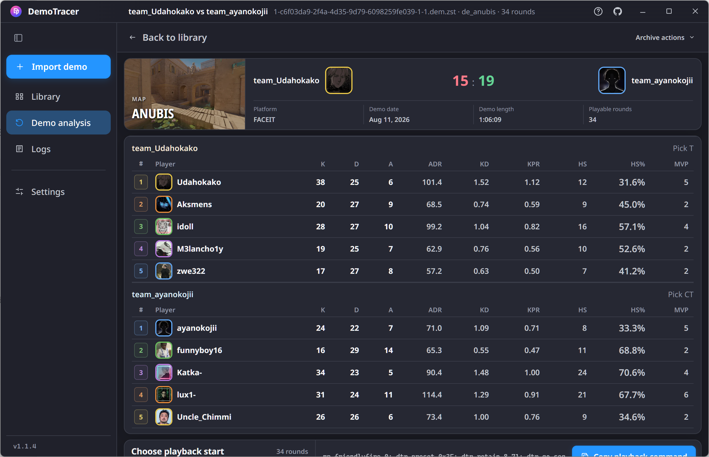
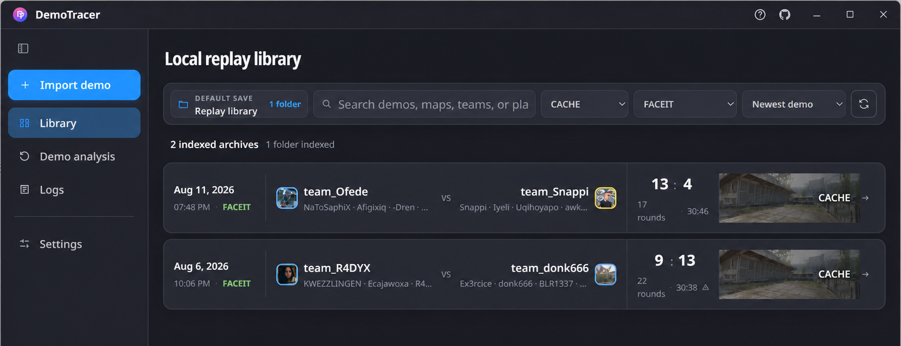
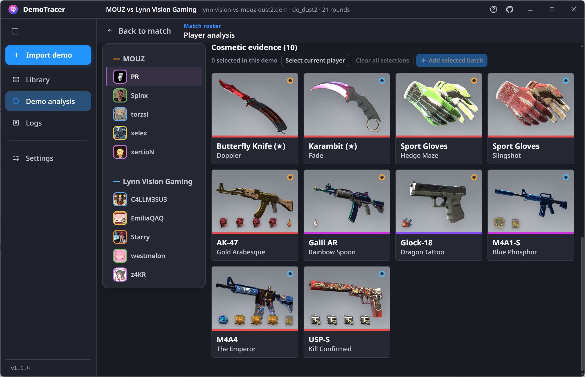

<p align="center">
  
</p>

<h1 align="center">CS2 DemoTracer</h1>

<p align="center">
  Analyze Counter-Strike 2 demos, export selected rounds, and replay them through bots on a local server.
</p>

<p align="center">
  <a href="https://github.com/unicbm/demotracer/releases/latest"><strong>Download for Windows</strong></a>
  · <a href="docs/README.md">Documentation</a>
  · <a href="docs/DEVELOPMENT.md">Development</a>
</p>

<p align="center">
  
  
  
</p>

<p align="center">
  
  <br>
  <sub>Inspect a converted match, choose where playback starts, and copy the ready-to-run server command.</sub>
</p>

## Playback Requirements for v1.5.0

Playback v1.5.0 uses Metamod's shared **KHook** engine for
BotController and BotHider function and virtual hooks. Hook registration,
chaining, and removal use the same engine as other KHook consumers, replacing
the runtimes' separate hook implementations.

This release requires **Metamod 2.0 build 1469+ (plugin API 18)** and a
**KHook-enabled CounterStrikeSharp build**. Older API 17 Metamod installations
cannot load these native plugins. Playback orchestration still uses
CounterStrikeSharp; see the pinned [server requirements](server/README.md#shared-hook-runtime)
before installing the playback bundle.

Update the GUI first, then install the complete v1.5.0 playback bundle. Metamod
and CounterStrikeSharp are external prerequisites and are not included in the
bundle. Do not mix DLLs from different builds.

## From Demo to Replay

DemoTracer is a matched Windows desktop app and CS2 playback bundle. Parsing,
analysis, conversion, archive management, environment checks, and updates are
handled from one GUI:

1. **Analyze** one demo or import up to eight demos as a batch. Split match
   recordings are recognized and merged automatically.
2. **Select** the rounds and fidelity options you want. DemoTracer reports
   suspicious rounds and warns when the source demo lacks replay input data.
3. **Organize** converted matches in a searchable local library by map, team,
   player, date, platform, and notes.
4. **Replay** a single round or a sequence through bots, using commands built
   by the app for the matched server plugin.

Parsing and export run locally through the Rust backend linked into the desktop
app. There is no separate converter CLI to install or maintain.

## Desktop Workflow

<p align="center">
  
  <br>
  <sub>Keep converted matches in a searchable local replay library.</sub>
</p>

The library can import existing archives, repair metadata, reconnect moved
source demos, and preserve custom notes. Opening a match exposes its score,
roster, round timeline, playback presets, and generated commands.

<p align="center">
  
  <br>
  <sub>Review demo-backed player identities, loadouts, stickers, charms, knives, gloves, and weapon finishes.</sub>
</p>

Cosmetic and identity data is evidence-gated: DemoTracer preserves what the
demo actually contains and avoids inventing missing values. Selected items can
also be handed off to the supported Inventory Simulator workflow. During
playback, DemoTracer passes validated cosmetic parameters to the matched
BotRandomizer provider; BotRandomizer alone applies them during natural bot
spawn and item construction.

## What Can Be Replayed

Depending on the source demo and selected options, a replay can preserve:

- movement, view angles, buttons, and available subtick input;
- weapons, purchases, drops, shooting history, and grenade throws;
- freeze-time pre-roll, score, names, team presentation, chat, and optional voice;
- demo-backed avatars, agents, crosshairs, viewmodels, knives, gloves, weapon
  finishes, stickers, charms, music kits, and scoreboard details.

Valid subtick input and referenced shooting history are always exported when
present. Freeze-time pre-roll follows the demo's contiguous freeze phase, with
an internal 120-second safety cap; neither behavior requires a user setting.

Movement playback uses maintained movement and input hooks rather than
teleporting bots along a drawn route. If a source demo omits essential raw
input, the desktop app reports that limitation before conversion.

## Playback Results

<table>
  <tr>
    <td align="center" width="50%">
      <br>
      <sub>First-person route replay</sub>
    </td>
    <td align="center" width="50%">
      <br>
      <sub>Indoor route replay</sub>
    </td>
  </tr>
  <tr>
    <td align="center" width="50%">
      <br>
      <sub>Mirage multi-bot opening</sub>
    </td>
    <td align="center" width="50%">
      <br>
      <sub>Projectile-aligned Mirage smokes</sub>
    </td>
  </tr>
</table>

## Get Started

Download the two Windows x64 assets from the
[latest official release](https://github.com/unicbm/demotracer/releases/latest):

- `demotracer-gui-vVERSION.exe` — desktop installer.
- `demotracer-css-vVERSION.zip` — matched playback plugins and native runtimes.

The desktop app supports Windows 10 and Windows 11 x64 and requires Microsoft
Edge WebView2. Demo analysis, conversion, and library management do not require
Python, Node.js, Rust, .NET, or a running CS2 server after installation.

To play an exported replay, use a local Windows x64 CS2 server with
[Metamod:Source](https://www.sourcemm.net/) and
[CounterStrikeSharp](https://github.com/roflmuffin/CounterStrikeSharp).
Use Metamod 2.0 build 1469+ and the KHook-enabled CounterStrikeSharp source
baseline listed in the [playback server requirements](server/README.md#shared-hook-runtime).
In **Settings → CS2**, select the CS2 folder, inspect the
installation, and install the matched playback bundle. Inspection reports file
integrity and fresh DemoTracer ABI/API heartbeat evidence separately. It does
not automatically verify the installed Metamod plugin API, CSS KHook backend,
or compatibility with other plugins; those remain unverified. A successful
bundle installation confirms the package was installed, not that the server
can load it. Inspection results show their check time and are not restored
from an earlier desktop session.

## Local-First and Defensive

- Demo parsing, replay generation, archives, configuration, and logs stay on
  the local machine.
- Optional update, Steam profile, and anonymous telemetry behavior is
  documented in [Online behavior](docs/ONLINE_SERVICES.md) and
  [Telemetry](docs/TELEMETRY.md).
- Replay control is for bots on a local server and must never be assigned to
  human players. DemoTracer is not matchmaking or cheating software.
- Desktop releases and playback bundles select compatible component releases;
  `.dtr`, manifest, runtime and companion API contracts are validated explicitly.

Only artifacts attached by `unicbm` to this repository's GitHub Releases are
official builds. See the [Trademark and Official Build Policy](TRADEMARKS.md).

## Source and Component Maintenance

This repository owns the GUI, product integration and matched release bundle.
The parser, converter, playback plugin, bot runtimes and shared infrastructure
are maintained in their own repositories and pinned here as Git submodules.
[components.json](components.json) records their repository and mount paths.

The [`cs2-css-demotracer`](https://github.com/unicbm/cs2-css-demotracer) playback
component is mounted at `server/plugins/DemoTracer`, with production code in
`src/DemoTracer`, configuration templates in `config`, and its regression suite
in `tests/DemoTracer.Tests`.

```powershell
git clone --recurse-submodules https://github.com/unicbm/demotracer.git
# For an existing checkout:
git submodule update --init --recursive
```

Component fixes go through that component's checks, PR and release first. The
`automation/components` PR then proposes updated release gitlinks for product
validation. It follows our maintained component releases, without automatically
merging original upstream code. Component source versions, GUI/Playback versions
and API/ABI versions remain independent; see [Development](docs/DEVELOPMENT.md).

## Documentation

- [User documentation](docs/README.md) — product guides and maintained references.
- [Commands](docs/COMMANDS.md) — playback commands, options, and runtime defaults.
- [`.dtr` format](docs/FORMAT.md) — binary layout, validation, and decoder limits.
- [Development](docs/DEVELOPMENT.md) — architecture, source builds, validation,
  native tooling, and release packaging.
- [Contributing](CONTRIBUTING.md) — contribution workflow and repository boundaries.

## Credits and License

DemoTracer builds on
[CS2-Bot-Controller](https://github.com/XBribo/CS2-Bot-Controller),
[CS2-Bot-Hider](https://github.com/XBribo/CS2-Bot-Hider),
[CS2-Bot-Improver](https://github.com/ed0ard/CS2-Bot-Improver),
[demoparser](https://github.com/LaihoE/demoparser),
[minidemo-encoder](https://github.com/csgowiki/minidemo-encoder),
Metamod:Source, and CounterStrikeSharp. `minidemo-encoder` provided an early
foundation for reconstructing continuous movement from discrete demo
trajectories.

First-party source is licensed under **AGPL-3.0-only**. Vendored components and
datasets retain their recorded licenses and attribution. The code license does
not grant rights to misrepresent modified builds as official releases.

Selected information-layout and demo-presentation references draw from
[CS2 Insight Agent](https://github.com/DrEAmSs59/CS2-insight-agent) under direct,
paid, project-specific authorization from DrEAmSs59. The original reference
material remains the property of that project and is not granted to third
parties under DemoTracer's AGPL-3.0-only license. See the maintained
[source and authorization notice](docs/CS2_INSIGHT_GUI_REFERENCE.md).
