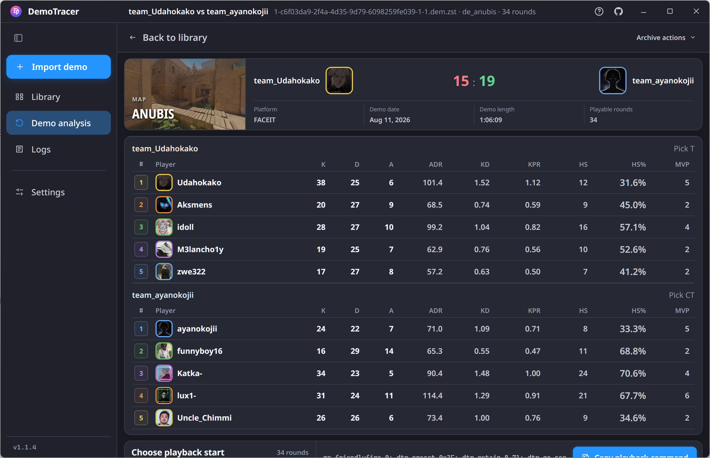
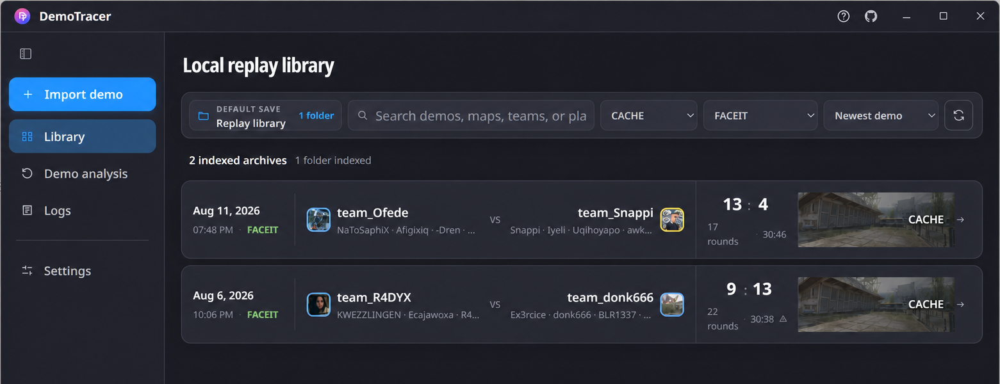
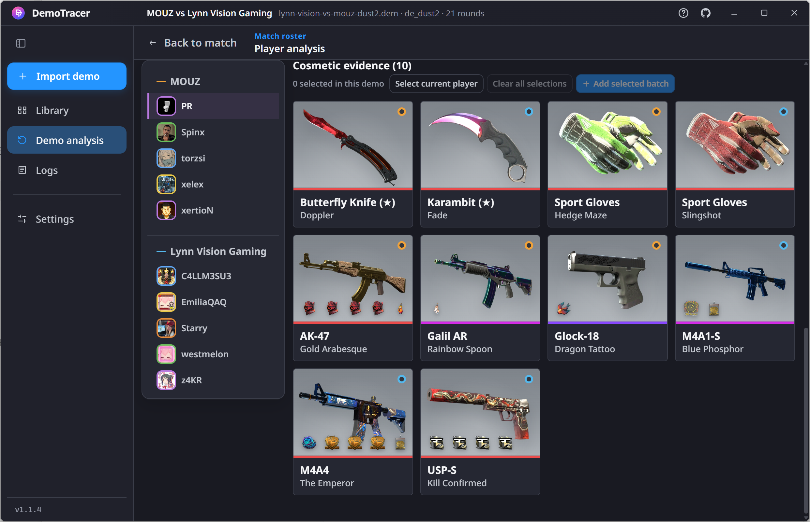

<p align="center">
  
</p>

<h1 align="center">CS2 DemoTracer</h1>

<p align="center">
  Analyze Counter-Strike 2 demos, export selected rounds, and replay them through bots on a local server.
</p>

<p align="center">
  <a href="https://github.com/unicbm/demotracer/releases/latest"><strong>Download for Windows</strong></a>
  · <a href="docs/README.md">Documentation</a>
  · <a href="docs/DEVELOPMENT.md">Development</a>
</p>

<p align="center">
  
  
  
</p>

<p align="center">
  
  <br>
  <sub>Inspect a converted match, choose where playback starts, and copy the ready-to-run server command.</sub>
</p>

## Get Started

1. Download the Windows x64 installer (`demotracer-gui-vVERSION.exe`) from the
   [latest release](https://github.com/unicbm/demotracer/releases/latest).
   The app requires Windows 10/11 and Microsoft Edge WebView2.
2. Analyze a demo, or import up to eight at once. Split recordings are merged
   automatically. Select rounds and export them to the local replay library.
3. For playback, prepare a local Windows x64 CS2 server with **Metamod 2.0 build 1469+
   (plugin API 18)** and a **KHook-enabled CounterStrikeSharp build**. See the
   [server requirements](server/README.md#shared-hook-runtime) for exact pins.
4. In **Settings → CS2**, select the CS2 folder and install the matched playback
   bundle (`demotracer-css-vVERSION.zip`). Metamod and CounterStrikeSharp are
   installed separately. Update the GUI first and keep the bundle's DLLs together.
5. Open a converted match and copy its playback command to the server console.

Analysis and conversion work locally without a server or developer tools.
Playback controls bots only.

## Desktop Workflow

<p align="center">
  
  <br>
  <sub>Keep converted matches in a searchable local replay library.</sub>
</p>

Import archives, repair metadata, reconnect moved demos and keep notes in the
library. Open a match for its roster, timeline and playback commands.

<p align="center">
  
  <br>
  <sub>Review demo-backed player identities, loadouts, stickers, charms, knives, gloves, and weapon finishes.</sub>
</p>

Appearance data comes from the demo. Selected items can be sent to Inventory
Simulator; during playback, BotRandomizer applies them to bots.

## What Can Be Replayed

Depending on the source demo and selected options, a replay can preserve:

- movement, view angles, buttons, and available subtick input;
- weapons, purchases, drops, shooting history, and grenade throws;
- freeze-time pre-roll, score, names, team presentation, chat, and optional voice;
- demo-backed avatars, agents, crosshairs, viewmodels, knives, gloves, weapon
  finishes, stickers, charms, music kits, and scoreboard details.

Movement uses native movement and input hooks. The app warns when a demo lacks
essential input. Available subtick input and shooting history are exported
automatically; freeze-time pre-roll follows the demo, capped at 120 seconds.

## Playback Results

<table>
  <tr>
    <td align="center" width="50%">
      <br>
      <sub>First-person route replay</sub>
    </td>
    <td align="center" width="50%">
      <br>
      <sub>Indoor route replay</sub>
    </td>
  </tr>
  <tr>
    <td align="center" width="50%">
      <br>
      <sub>Mirage multi-bot opening</sub>
    </td>
    <td align="center" width="50%">
      <br>
      <sub>Projectile-aligned Mirage smokes</sub>
    </td>
  </tr>
</table>

## Data and Updates

Demos, generated replays, archives and logs stay on your machine. Update checks,
Steam profile requests and telemetry are described in
[Online behavior](docs/ONLINE_SERVICES.md). Anonymous aggregate statistics are
enabled by default; active-user estimates require opt-in.

Only artifacts attached by `unicbm` to this repository's GitHub Releases are
official builds. See [Trademarks](TRADEMARKS.md).

## Development

```powershell
git clone --recurse-submodules https://github.com/unicbm/demotracer.git
```

See [Development](docs/DEVELOPMENT.md) for builds and packaging,
[Commands](docs/COMMANDS.md) for playback, and [Contributing](CONTRIBUTING.md)
for changes. All references are in the [documentation index](docs/README.md).

## Credits and License

DemoTracer builds on
[CS2-Bot-Controller](https://github.com/XBribo/CS2-Bot-Controller),
[CS2-Bot-Hider](https://github.com/XBribo/CS2-Bot-Hider),
[CS2-Bot-Improver](https://github.com/ed0ard/CS2-Bot-Improver),
[demoparser](https://github.com/LaihoE/demoparser),
[minidemo-encoder](https://github.com/csgowiki/minidemo-encoder),
Metamod:Source, and CounterStrikeSharp. `minidemo-encoder` provided an early
foundation for reconstructing continuous movement from discrete demo
trajectories.

First-party source is licensed under **AGPL-3.0-only**. Vendored components and
datasets retain their recorded licenses and attribution. The code license does
not grant rights to misrepresent modified builds as official releases.

Selected information-layout and demo-presentation references draw from
[CS2 Insight Agent](https://github.com/DrEAmSs59/CS2-insight-agent) under direct,
paid, project-specific authorization from DrEAmSs59. The original reference
material remains the property of that project and is not granted to third
parties under DemoTracer's AGPL-3.0-only license. See the maintained
[source and authorization notice](docs/CS2_INSIGHT_GUI_REFERENCE.md).
